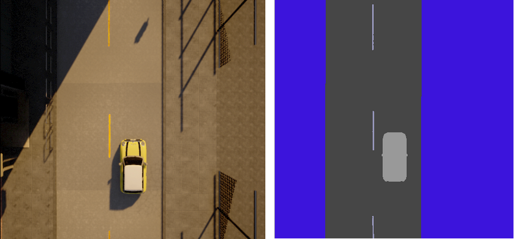

# min-carla-env


A minimal 2d Carla environment implementation for Deep Reinforcement Learning researchs. The environment supposed to be a minimal starter code for RL environment and models. It has 2d view observations in minimal semantic segmentation or RGB. The agent will get positive reward if its in the center of the road or it will get a negative reward based on the distance to the center. The environment is not fully Open AI `gym` compatible but it is a `gym` like environment. So you can try basic RL methods over it. 

The repo has two core files: `matrix_world.py` that includes Carla world operations, car, sensors, etc. and `env.py` that contains `gym` like environment that has run and reset operations and prepares rewards, observations and etc.

Here some basic features you can use:
- 2D like RGB or minimal semantic segmented observations
- Able to change width and height of the observations
- Use different weather conditions
- Works with different maps
- Includes fast mode to use in training
- Has parameter to run without rendering
- Debug mode

> There is an article includes brief implementation details, aims and goals of the 2D Carla environment, check it out [here](https://mcemilg.github.io/general/2020/08/20/carla/) if you interested 

You can find an example model trained with the environment. The model is a simple DQN model adjusted from [here](https://pytorch.org/tutorials/intermediate/reinforcement_q_learning.html) to the environment. There are some differences from the original implementation like epsilon decay, optimization steps and etc. Here is video from the trained model:

[](https://www.youtube.com/watch?v=TJ2QkC6DSng)

You can run the pretrained model demo with the following command:

```bash
$ python -m models.run --path models/model/base-model.pt
```

## Basic Usage

The file `run.py` contains a runnable usage in it. Also here a snippet to make it run:

```python
import carla
from min_carla_env.env import CarlaEnv, CONFIG

try:
    env = CarlaEnv(client, CONFIG)
    old_obs = env.reset()
    done = False
    t = 0
    total_reward = 0.0
    while not done:
        t += 1
        obs, reward, done, _ = env.step(0)  # Go Forward
        total_reward += reward
        print("step#:", t, "reward:", round(reward, 4),
              "total_reward:", round(total_reward, 4), "done:", done)
finally:
    env.mw.clean_world()
```

## Licence
MIT
